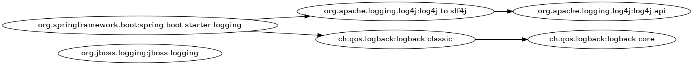
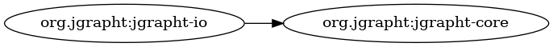
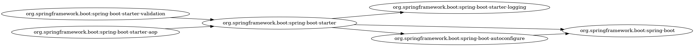
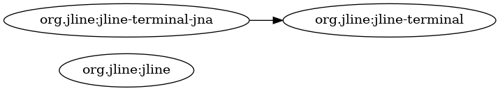
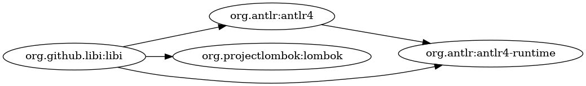
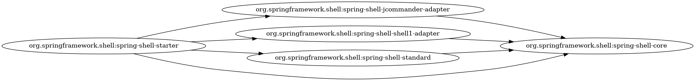
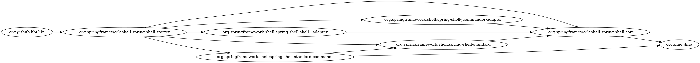
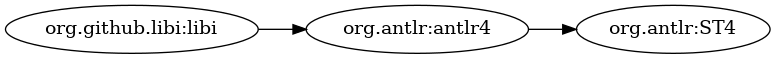
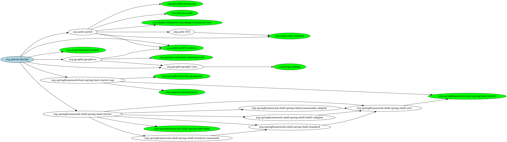

# Libi

**Libi** is a simple command line tool to analyse and visualise dependencies between projects.
Written in Java for gradle projects, but can be extended further to use with other languages and
build tools. It runs as interactive shell with all power inherited from spring shell library.

## Getting Started

### Linux

- configure image viewer in `application.properties` file. Initially it is set to default viewer for
  Linux Mint - xviewer.
- build project `./gradlew build`
- run application `./libi`

### Windows

- configure image viewer in `application.properties` file. Initially it is set to default viewer for
  Linux Mint - xviewer.
- set gradlew command in `application.properties` to `gradlew.bat`
- build project `gradlew.bat build`
- run application `libi.bat`

## Shell commands

### `scan-dir`

Unfortunately you will need it at least once. When you run it, please make a coffee, eat a pizza, go
for a walk, and when you are back, if your laptop is not burnt, scanning should be finished. If not,
think about watching all episodes of 'Game of Thrones' to fill in the time. But seriously, it can
take some time depending on how many projects you have and how complicated they are (eg. with many
subprojects). Scanning runs `gradlew dependencies` for every project/subproject to get dependency
tree.

example 1

```
scan-dir /home/bartek/src/java/libi libi
```

This will scan only one project 'libi' and save result in graph called 'libi'.

example 2

```
scan-dir /home/bartek/src/java all
```

This will scan all projects in 'java' folder and save result in graph called 'all'. There will be
created single graph for all projects, to detect dependencies between them.

After scanning, created graph is saved in 'graphs' folder and also kept in memory as **working
graph**.

### `load`

If the graph is already created, you can load it from a file (the is no need to scan projects every
time when you run libi).

example

```
load libi
```

It loads graph from 'libi' file into memory as **working graph**.

### `list`

Simplest command that operates on **working graph** is `list`. It simply displays artifacts in
alphabetical order. To indicate which artifacts we want to display, we need LibiEL expression.

example 1

```
list "."
```

This will list all artifact that we have in our graph. It can be simplified to `list .` but for more
complicated expressions quotation marks are necessary, so it is better to always use them.

### `tsort`

Similar to list command, but the order is based on topological sort of artifacts. It is useful if
you are working on many related libraries and want to find out what should be the build/release
order of them.

example

```
tsort "."
```

### `diagram`

It is the key command in libi. It generates diagram for selected artifacts.

example

```
diagram "re 'libi' -> re 'spring'" --show
```

This will generate diagram with all direct dependencies of 'libi' to 'spring' artifacts and show it
in configured image viewer.

### `function`

It is possible to create own 'libi' functions (with no arguments).

example

```
function libi "id 'org.github.libi:libi'"
function springboot "gid 'org.springframework.boot'"
```

This will create two functions, first that selects 'libi' artefacts and second all artifacts from
spring boot. Then to wie all spring boot dependencies in 'libi' project, you can simply
run `diagram "libi --> springboot" --show` or `diagram "libi + springboot" --show --transitive` to
exclude transitive dependencies.

### `functions`

List all 'libi' functions - built-in an defined by user.

### `color`

A bit similar to function. It defines color for artifacts on diagram.

example

```
color lightgreen "re 'spring'"
```

After this command, all artifacts containing 'spring' on diagrams will be colored to light green.

### `clear-colors`

Clear all colors settings.

### `colors`

List all colors settings.

## LibiEL

LibiEL is simple expression language dedicated to dependency graph filtering. Instead of giving full
formal language definition (grammar is available in `LibiEL.g4` file) i will describe some sample
expressions.

### `.`

Dot means current context of processing. If used alone - means the whole **working graph**.

```
shell:>count "."
Found 51 artifacts
```

### `re ''`

Filter artefacts using regexp on full artifact id.

```
shell:>diagram "re 'log'" --show --name diagram1
Created diagram with 6 artifacts
```



### `id ''`

Find artifact by id.

```
shell:>diagram "id 'org.jgrapht:jgrapht-core' + id 'org.jgrapht:jgrapht-io'" --show --name diagram2
Created diagram with 2 artifacts
```



### `gre ''`

Filter artefacts using regexp on group name.

```
shell:>diagram "gre 'boot'" --show --name diagram3
Created diagram with 6 artifacts
```



### `gid ''`

Find artifacts by group id.

```
shell:>diagram "gid 'org.jline'" --show --name diagram4
Created diagram with 3 artifacts
```



### `->` `<-`

Short arrows are used to find direct dependencies. Can be uses as an infix operator or as a suffix.

```
shell:>diagram "re 'libi' -> (re 'antlr' + re 'lombok')" --show --name diagram5
Created diagram with 4 artifacts
```



```
shell:>diagram "id 'org.springframework.shell:spring-shell-core' <-" --show --name diagram6
Created diagram with 5 artifacts
```



### `-->` `<--`

Long arrows are used to find all dependencies including transitive. Similar to short arrows it can
be use as infix or suffix.

```
shell:>diagram "re 'libi' --> id 'org.jline:jline'" --show --name diagram7
Created diagram with 8 artifacts
```



```
shell:>diagram "re 'ST4' <--" --show --name diagram8
Created diagram with 3 artifacts
```



### function call

Function without argument can be called without brackets. User can define own functions without
arguments using LibiEL expressions.

```
shell:>color green "leaves"
shell:>color lightblue "roots"
shell:>diagram "re 'libi' -> ->" --show --name diagram9
Created diagram with 24 artifacts
```



```
shell:>function libi "re 'libi'"
shell:>list "compile(libi) - runtime(libi)"
Found 1 artifacts:
org.projectlombok:lombok
```

### `filter`

Filter is narrowing working graph to given artifact set. All graph aware operations after 'filter'
will work on graph defined by expression before 'filter'.

```
shell:>list "re 'starter' filter isolated"
Found 1 artifacts:
org.springframework.shell:spring-shell-starter
```

## Dependencies

- [JGraphT](https://jgrapht.org/) is Java library providing graph-theory objects, algorithms and
  serialization utils to many common formats. JGraphT is licensed under the terms of the Eclipse
  Public License (EPL).
- [ANTLR](https://www.antlr.org/) is a parser generator. ANTLR is licensed under the terms of the
  BSD 3-clause license
- [Spring](https://spring.io/) is a general purpose application framework for Java platform. Spring
  is licensed under the terms of the Apache License 2.0
- [Gradle](https://gradle.org/) is a build tool licensed under the terms of the Apache License 2.0

## External applications

### Graphviz

Libi can call graphviz as external program to automatically generate graph diagrams.

### Gradlew

When scanning for dependencies in every folder gradlew script is called to get dependency tree.